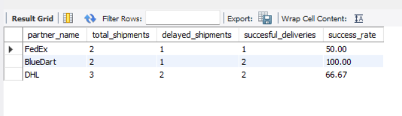

E-Commerce Logistics Analysis – SwiftShip
Business Case

SwiftShip is a third-party logistics provider that handles a large number of shipments daily. The company faces challenges such as lost shipments and difficulty in identifying underperforming delivery partners. This project focuses on analyzing shipment data to improve delivery efficiency and partner performance.

Objectives
-Design a database to track shipments and delivery activities
-Identify delayed shipments
-Evaluate delivery partner performance
-Analyze the most frequent delivery destinations
-Database Schema

The system is built using three main tables:

Partners – stores delivery partner details
Shipments – contains shipment and delivery date information
DeliveryLogs – tracks delivery status such as delivered or returned

Analysis Performed
Identified shipments that were delivered later than the promised date
Compared delivery partners based on successful and returned shipments
Ranked partners based on delay performance
Found the most popular destination city in the last 30 days

Output Screenshots

Delayed Shipments
<Delayed Shipments

  

Partner Performance

  

Popular Destination

  

Partner Scorecard

  

