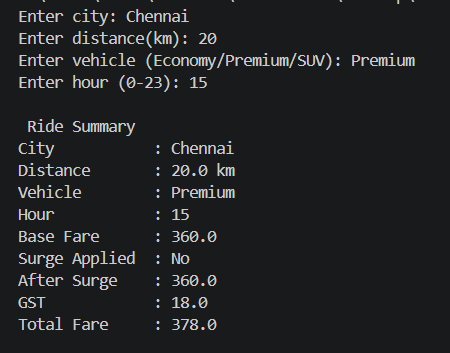

# FareCalc

FareCalc – Travel Fare Optimizer

FareCalc is a Python-based backend utility designed to simulate dynamic pricing in a ride-sharing system. It calculates ride fares based on distance, vehicle type, and time-based surge pricing, similar to real-world applications.

Business Scenario

A ride-sharing startup CityCab requires a smart fare calculation system where pricing is not fixed. Instead, it varies depending on distance traveled, vehicle category, and peak-hour surge pricing.

This project demonstrates how such a system can be implemented using core Python concepts.

Features

- Dynamic pricing based on distance and vehicle type  
- Time-based surge pricing (1.5x) during peak hours (5 PM – 8 PM)  
- Multiple vehicle categories (Economy, Premium, SUV)  
- Error handling for invalid inputs  
- Formatted price receipt output  

Concepts Used

- Dictionary Mapping  
- Functions  
- Conditional Statements  
- Exception Handling  
- User Input Handling  

Fare Calculation Logic

- Base Fare = Distance × Rate per km  
- Surge Pricing applied if hour is between 17 and 20  
- Final Fare = Base Fare × Surge Multiplier  

Output Screenshot

  

