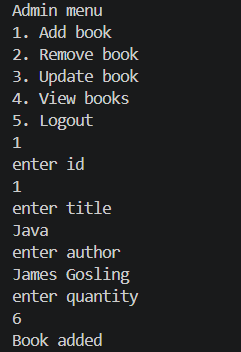
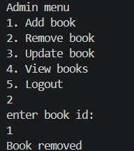
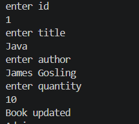
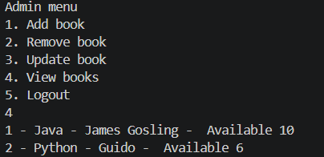
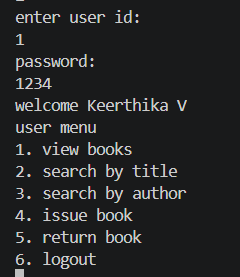
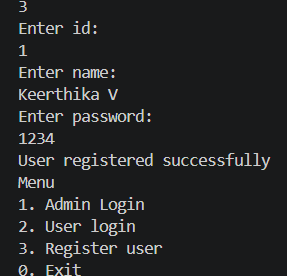
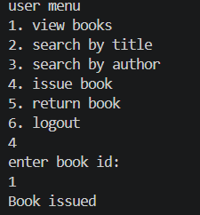
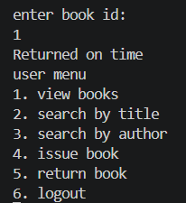

# Virtusa_Library_Management_System
A console-based Library Management System built using Core Java with OOP principles, supporting user/admin authentication, book inventory management, issue-return tracking, and fine calculation.

# 📚 Library Management System

A console-based **Library Management System** built using Core Java and Object-Oriented Programming (OOP) principles.  
This project automates book management, user handling, and issue-return tracking with fine calculation.

Features

Admin
- Add new books
- Remove books
- Update book details
- View all books

User
- User registration & login
- View available books
- Search books by title and author
- Issue books
- Return books
- Fine calculation for late return

Technologies Used
- Core Java
- OOP Concepts
- ArrayList (Dynamic Data Storage)
- Java Time API (LocalDate)

Output Images:

<h3>Add Book</h3>

<h3>Remove Book</h3>

<h3> Update Book</h3>

<h3>View Books</h3>

<h3>User Login</h3>

<h3>User Registration</h3>

<h3>Issue Book</h3>

<h3>Return Book</h3>

