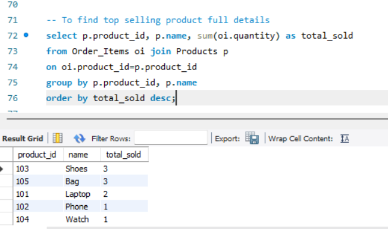
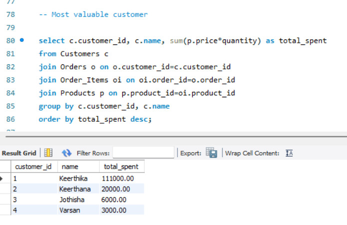
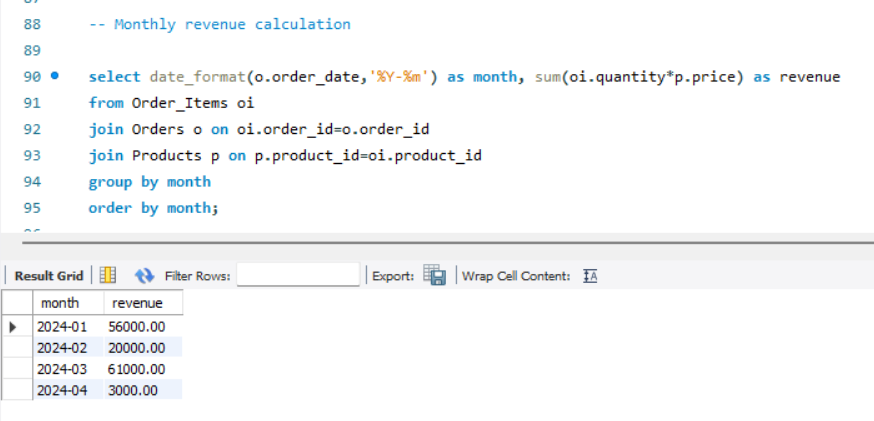
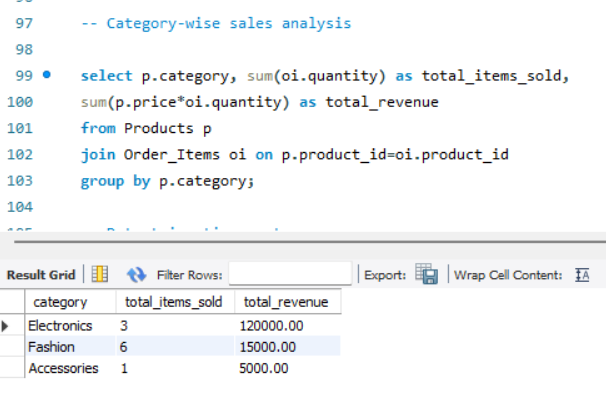
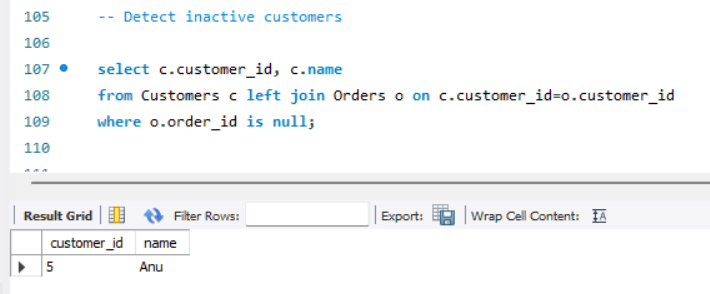

Problem Statement
Retail businesses generate huge sales data but lack structured insights. Design a database and write SQL queries to analyze sales performance.

 Objectives
- Create a relational database for an online store  
- Store customer, product, and order data  
- Extract meaningful insights using SQL queries  

Database Tables
- Customers (customer_id, name, city)  
- Products (product_id, name, category, price)  
- Orders (order_id, customer_id, date)  
- Order_Items (order_id, product_id, quantity)  

Key Tasks & Outputs

Top-Selling Products

  

Most Valuable Customers

  

Monthly Revenue

  

Category-wise Sales Analysis

  

Inactive Customers

  

