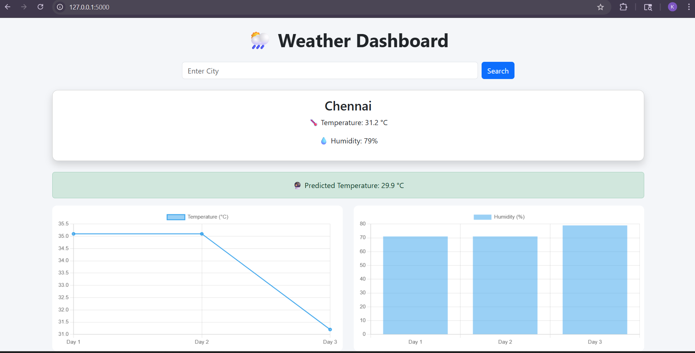

# Virtusa-Weather-Data-Analyzer-and-Forecast-Dashboard

This project is a simple web application built using Flask. It fetches real-time weather data, stores it, displays trends, and predicts the next temperature using a machine learning model.

Features

- Fetch real-time weather data using API  
- Store historical data  
- Display temperature and humidity using graphs  
- Predict next temperature using Linear Regression  

Technologies Used

- Python  
- Flask  
- HTML, CSS  
- Chart.js  
- pandas  
- scikit-learn  

Project Output

  

